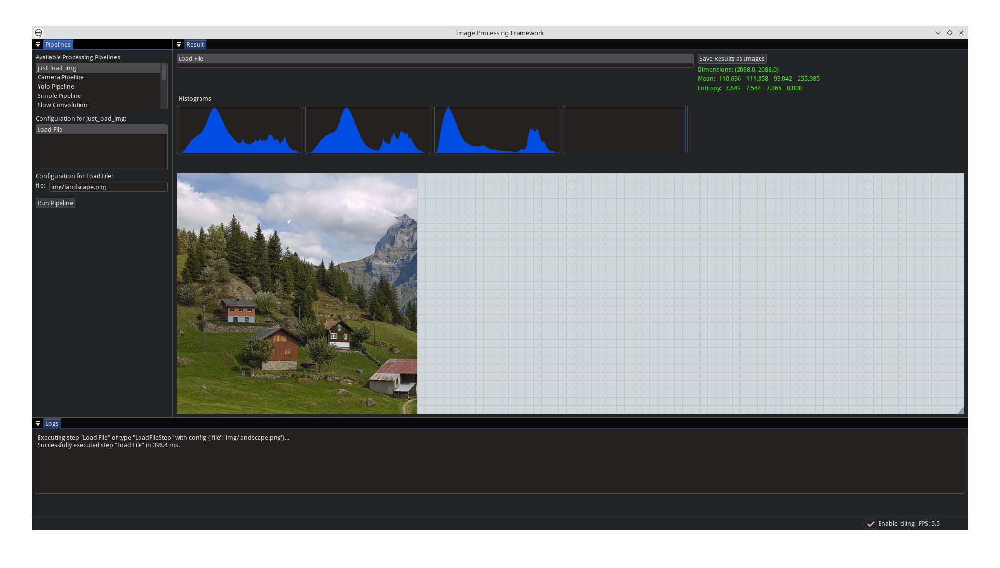
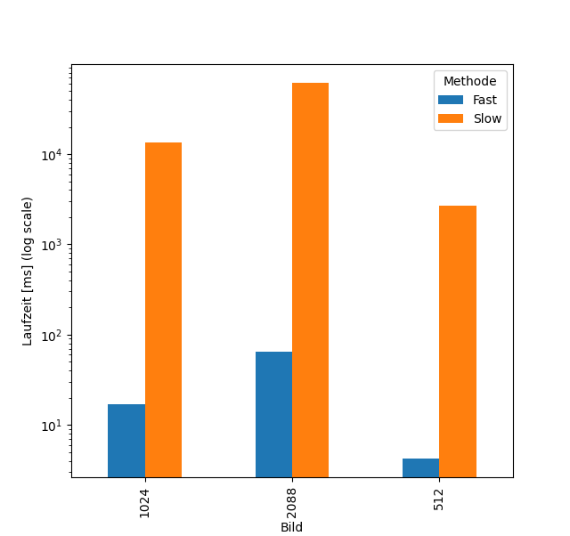
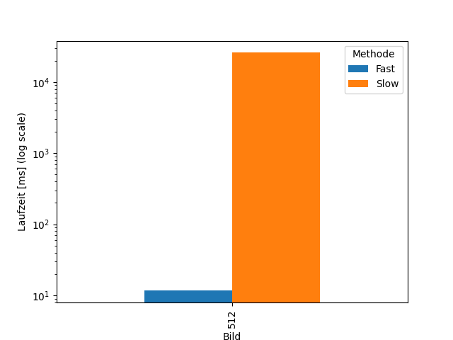
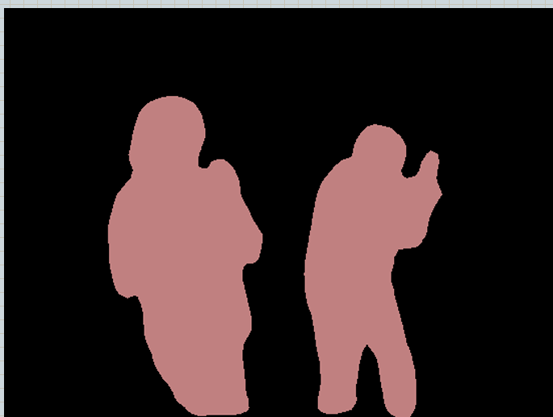

# Aufgabe 1.1

# Aufgabe 1.2

Die schnelle Variante ist deutlich schneller, weil sie vektorisierte NumPy-Operationen auf dem gesamten Bild nutzt, während die langsame Variante mit np.frompyfunc und einer Python-Funktion mehr Overhead erzeugt.
Größere Bilder haben mehr Pixel, weswegen mehr Berechnungen erforderlich sind, was die Laufzeit erhöht.
Kleine Unterschiede zwischen den Messungen sind normal und lassen sich durch Hintergrundprozesse, Cache-Effekte und allgemeine Systemschwankungen erklären.

Es wurden die folgenden drei Bildgrößen verwendet:
- `512 × 512 Pixel`
- `1024 × 1024 Pixel`
- `2088 × 2088 Pixel`

## Balkendiagramm der Laufzeiten:

## Tabelle mit Mittelwerten und Standardabweichungen:

| Bild | Methode  | mean         | std          |
|------|----------|--------------|--------------|
| 1024 | Fast     | 16.833333    | 1.001665     |
| 1024 | Slow     | 13329.166667 | 1154.011925  |
| 2088 | Fast     | 65.366667    | 2.532456     |
| 2088 | Slow     | 61261.900000 | 9735.530391  |
| 512  | Fast     | 4.266667     | 0.378594     |
| 512  | Slow     | 2664.833333  | 438.047045   |

# Aufgabe 3

## Balkendiagramm der Laufzeiten

## Tabelle mit Mittelwerten und Standardabweichungen

| Methode | mean         | std         |
|---------|--------------|-------------|
| Fast    | 11.633333    | 5.858612    |
| Slow    | 25860.400000 | 4974.656327 |

# Aufgabe 4

## Morphologische Operatoren

- ('kernel1', 'erosion'): 7.8,
- ('kernel1', 'dilation'): 8.0,
- ('kernel1', 'closing'): 15.8,
- ('kernel1', 'opening'): 13.8,
- ('kernel2', 'erosion'): 9.8,
- ('kernel2', 'dilation'): 8.0,
- ('kernel2', 'closing'): 13.8,
- ('kernel2', 'opening'): 13.8,
- ('kernel3', 'erosion'): 7.5,
- ('kernel3', 'dilation'): 8.0,
- ('kernel3', 'closing'): 13.8,
- ('kernel3', 'opening'): 15.8,

## Median-Filter

Resultat des Medianfilters auf Salt.jpg: Das Rauschen verschwindet, jedoch ist das Bild danach verschwommener.

# Aufgabe 1.5 – Semantic Segmentation

Man sieht grob die eingefärbten erkannten Bereiche. 
Das Modell ist nicht fehlerfrei, aber es erkennt grob die gelernten Labels.

